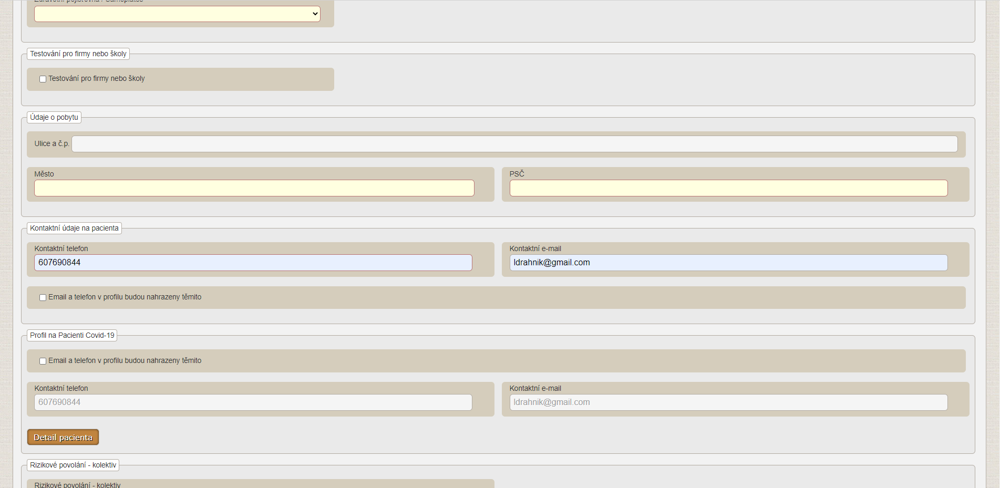
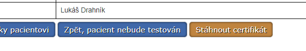
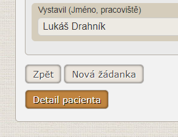
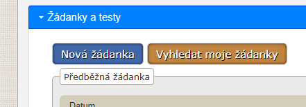
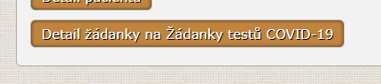
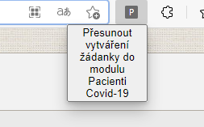
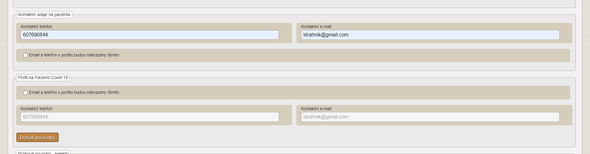

# PRO OC

[Rozšíření do Google Chrome](https://chrome.google.com/webstore/detail/pro-oc/ngckfggbhfikdghbcmfdkcjidoaelgbg), [Rozšíření do Mozilla Firefox](https://addons.mozilla.org/addon/pro-oc/)

Rozšíření přidává užitečné funkce do modulu [Pacienti COVID-19](https://ereg.ksrzis.cz/Registr/CUDZadanky/VyhledaniPacienta) a [Žádanky testů COVID-19](https://eregpublicsecure.ksrzis.cz/Registr/CUD/Overeni).

## Žádanky testů COVID-19

- Přidává tlačítko **Stáhnout certifikát** na stránku Overovani

## Pacienti COVID-19

- Přidává tlačítko **Detail pacienta** na detail žádanky

- Přidává tlačítko **Vyhledat moje žádanky** na detail pacienta do sekce **Žádanky a testy**

- Přidává tlačítko **Stornovat žádanku** i na detail PCR žádanky se zaškrtnutým **Provedl jsem odběr**

## Žádanky testů COVID-19 + Pacienti COVID-19

- Přidává tlačítko **Detail žádanky na Žádanky testů COVID-19** na detail žádanky v modulu **Pacienti Covid-19**

- Přidává možnost přesunout vytváření žádanky z **Žádanky testů Covid 19** do modulu **Pacienti COVID-19**

- Přidává možnost vidět a změnit přihlašovací údaje do aplikace [Tečka](https://ockodoc.mzcr.cz/napoveda/tecka/cz/) nebo [ocko.uzis.cz](https://ocko.uzis.cz/) včetně tlačítka **Detail pacienta**

