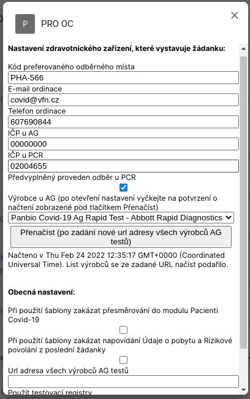

# PRO OC

[Rozšíření do Mozilla Firefox](https://addons.mozilla.org/addon/pro-oc/)

Rozšíření přidává užitečné funkce do modulu [Pacienti COVID-19](https://ereg.ksrzis.cz/Registr/CUDZadanky/VyhledaniPacienta) a [Žádanky testů COVID-19](https://eregpublicsecure.ksrzis.cz/Registr/CUD/Overeni) s cílem usnadnit práci s těmito systémy.

## Zásady ochrany osobních údajů

Osobní informace pacientů podmíněné přihlášením do modulu [Pacienti COVID-19](https://ereg.ksrzis.cz/Registr/CUDZadanky/VyhledaniPacienta) a webové aplikace [Žádanky testů COVID-19](https://eregpublicsecure.ksrzis.cz/Registr/CUD/Overeni) jsou použity pouze pro přidání nových funkcí zmíněných níže. Přidané funkce využívají již stávajících funkcí obou systémů. **Žádná data nejsou jakkoliv zpracovávána ani přeposílána mimo tyto systémy.**

## Žádanky testů COVID-19

- Přidává tlačítko **Stáhnout certifikát** na stránku Overovani

- Přidává tlačítko **Detail pacienta** na stránku Overovani

- Přidává zobrazení aktivních žádanek a tlačítko **Zkontrolovat žádanku** při vytváření nové žádanky

- Na stránce Oveření antigenního testu předvyplnuje kód a title výrobce z nastavení a negativní výsledek

## Pacienti COVID-19

- Přidává tlačítko **Detail pacienta** na detail žádanky

- Přidává tlačítko **Vyhledat pacienta** na detail pacienta do sekce **Detail pacienta**

- Přidává tlačítko **Vyhledat moje žádanky** na detail pacienta do sekce **Žádanky a testy**

- Přidává tlačítko **Sloučit automaticky** na detail profilu

- Přidává tlačítko **Stornovat žádanku** i na detail PCR žádanky se zaškrtnutým **Provedl jsem odběr**

## Žádanky testů COVID-19 + Pacienti COVID-19

- Přidává tlačítko **Detail žádanky na Žádanky testů COVID-19** na detail žádanky v modulu **Pacienti Covid-19**

- Přidává možnost přesunout vytváření žádanky z **Žádanky testů Covid 19** do modulu **Pacienti COVID-19**

- Přidává možnost vidět a změnit přihlašovací údaje do aplikace [Tečka](https://ockodoc.mzcr.cz/napoveda/tecka/cz/) nebo [ocko.uzis.cz](https://ocko.uzis.cz/) včetně tlačítka **Detail pacienta**

- Na stránce ověření žádanky zobrazuje údaje na profilu (email, telefon) a umožňuje tlačítkem **Uložit na profil** tyto údaje přepsat údaji ze žádanky

- Přidává možnost předvyplnit vytvářenou žádanku za pomoci před-definovaných šablon **PCR na pojišťovnu / samoplátce, AG na pojišťovnu / samoplátce a PCR konfirmační na pojišťovnu / samoplátce**, které jdou použít kliknutím na tlačítko s již zmíněných názvem šablony nebo použitím nastavené klávesové zkratky. Zkratky jdou nastavit PCR/AG na pojišťovnu/samoplátce šablonám. Navrhované klávesové zkratky jsou uvedené v závorce na přiloženém obrázku.

Zmíněné šablony jdou částečně upravit v nastavení v sekci **Nastavení zdravotnického zařízení, které vystavuje žádanku:**. Ostatní hodnoty šablony jsou: 

| | Klávesová zkratka | Zdravotní pojišťovna / Samoplátce | Kontaktní telefon | Rizikové povolání - kolektiv | POCT | Testovaný e-mail | Symptomy | Klinicky závažný stav | Indikace | Typy testů | Proveden odběr | Preferované odběrné místo | Prioritizace odběru | Ordinace e-mail | Ordinace telefon | Ordinace IČP | Vystavil
|-|-|-|-|-|-|-|-|-|-|-|-|-|-|-|-|-|-|
| PCR pojišťovna | Default (Ctrl + Shift + P) | / | * | Default Jiné (RizikovePovolaniKod=Jine) | Neprovedl jsem POCT test, chci jen vystavit žádanku (TypPoctTestu=1) | | Default Jiné (SymptomZadne=True) | Default No (KlinickyZavaznyStav=False) | Preventivní (Indikace=3) | PCR (TypyTestu=PCR) | Default false (u PCR vždy z nastavení ProvedenOdber=True|False) | / (v případě neprázdné hodnoty z nastavení např. PHA-566) | / | / (v případě neprázdné hodnoty z nastavení např. reditel@vfn.cz) | / (v případě neprázdné hodnoty z nastavení) | / (v případě neprázdných hodnot z nastavení, odlišeno pro AG a PCR např. 02004657 a 02004655) | Jméno a příjmení z cookies nastavované na přihlašovací stránce https://eregpublicsecure.ksrzis.cz/Registr/CUD/Overeni/Prihlaseni |
| PCR samoplátce | Default (Ctrl + Shift + O) | **Samoplátce** ZdravotniPojistovnaKod=300 | * | Default Jiné (RizikovePovolaniKod=Jine) | Neprovedl jsem POCT test, chci jen vystavit žádanku (TypPoctTestu=1) | / | Default Jiné (SymptomZadne=True) | Default No (KlinickyZavaznyStav=False) | Preventivní (Indikace=3) | PCR (TypyTestu=PCR) | Default false (u PCR vždy z nastavení ProvedenOdber=True|False) | / (v případě neprázdné hodnoty z nastavení např. PHA-566) | / | / (v případě neprázdné hodnoty z nastavení např. reditel@vfn.cz) | / (v případě neprázdné hodnoty z nastavení) | / (v případě neprázdných hodnot z nastavení, odlišeno pro AG a PCR např. 02004657 a 02004655) | Jméno a příjmení z cookies nastavované na přihlašovací stránce https://eregpublicsecure.ksrzis.cz/Registr/CUD/Overeni/Prihlaseni |
| PCR konfirmační na pojišťovnu | - | / | * | Default Jiné (RizikovePovolaniKod=Jine) | Neprovedl jsem POCT test, chci jen vystavit žádanku (TypPoctTestu=1) | | Default Jiné (SymptomZadne=True) | Default No (KlinickyZavaznyStav=False) | Konfirmační (Indikace=5) | PCR (TypyTestu=PCR) | Default false (u PCR vždy z nastavení ProvedenOdber=True|False) | Default (OdberneMistoKod=PHA-566) | /  | / (v případě neprázdné hodnoty z nastavení např. reditel@vfn.cz) | / (v případě neprázdné hodnoty z nastavení) | / (v případě neprázdných hodnot z nastavení, odlišeno pro AG a PCR např. 02004657 a 02004655) | Jméno a příjmení z cookies nastavované na přihlašovací stránce https://eregpublicsecure.ksrzis.cz/Registr/CUD/Overeni/Prihlaseni |
| PCR konfirmační samoplátce | / | **Samoplátce** ZdravotniPojistovnaKod=300 | * | Default Jiné (RizikovePovolaniKod=Jine) | Neprovedl jsem POCT test, chci jen vystavit žádanku (TypPoctTestu=1) | / | Default Jiné (SymptomZadne=True) | Default No (KlinickyZavaznyStav=False) | Konfirmační (Indikace=5) | PCR (TypyTestu=PCR) | Default false (u PCR vždy z nastavení ProvedenOdber=True|False) | / (v případě neprázdné hodnoty z nastavení např. PHA-566) | / | / (v případě neprázdné hodnoty z nastavení např. reditel@vfn.cz) | / (v případě neprázdné hodnoty z nastavení) | / (v případě neprázdných hodnot z nastavení, odlišeno pro AG a PCR např. 02004657 a 02004655) | Jméno a příjmení z cookies nastavované na přihlašovací stránce https://eregpublicsecure.ksrzis.cz/Registr/CUD/Overeni/Prihlaseni |
| AG samoplátce | Default (Ctrl + Shift + S) | **Samoplátce** ZdravotniPojistovnaKod=300 | * | Default Jiné (RizikovePovolaniKod=Jine) | Neprovedl jsem POCT test, chci jen vystavit žádanku (TypPoctTestu=1) | / | Default Jiné (SymptomZadne=True) | Default No (KlinickyZavaznyStav=False) | Preventivní (Indikace=3) | Antigen (TypyTestu=Antigen) | **Neproveden** (ProvedenOdber=False) | / (v případě neprázdné hodnoty z nastavení např. PHA-566) | / | / (v případě neprázdné hodnoty z nastavení např. reditel@vfn.cz) | / (v případě neprázdné hodnoty z nastavení) | / (v případě neprázdných hodnot z nastavení, odlišeno pro AG a PCR např. 02004657 a 02004655) | Jméno a příjmení z cookies nastavované na přihlašovací stránce https://eregpublicsecure.ksrzis.cz/Registr/CUD/Overeni/Prihlaseni |
| AG na pojišťovnu | Default (Ctrl + Shift + A) | / | * | Default Jiné (RizikovePovolaniKod=Jine) | Neprovedl jsem POCT test, chci jen vystavit žádanku (TypPoctTestu=1) | / | Default Jiné (SymptomZadne=True) | Default No (KlinickyZavaznyStav=False) | Preventivní (Indikace=3) | Antigen (TypyTestu=Antigen) | **Neproveden** (ProvedenOdber=False) | / (v případě neprázdné hodnoty z nastavení např. PHA-566) | / | / (v případě neprázdné hodnoty z nastavení např. reditel@vfn.cz) | / (v případě neprázdné hodnoty z nastavení) | / (v případě neprázdných hodnot z nastavení, odlišeno pro AG a PCR např. 02004657 a 02004655) | Jméno a příjmení z cookies nastavované na přihlašovací stránce https://eregpublicsecure.ksrzis.cz/Registr/CUD/Overeni/Prihlaseni |

- Při použití šablony se zobrazí vyskakovací okno s informací **Údaje o pobytu** a **Rizikové povolání** z minulé žádanky v případě, že nějaká vystavená byla. V případě informace **Rizikové povolání**, když nebyla použita defaultní možnost Jiné a v URL aktuální žádanky je nastavená defaultní možnost Jiné. **Rizikové povolání** vyskočí i v případě nezákázaného přesměrování zmíněného výše. **Údaje o pobytu** ne, protože bude doplněna trvalá adresa v modulu **Pacienti Covid-19**. Toto napovídání lze vypnout v nastavení.

- Na stránce nastavení je možné zapnout použití testovacích registrů. (např. to znamená, že v případě použití některé z šablon dojde k přesměrování buď na **testovací** registr **Pacienti COVID-19** nebo **Žádanky testů Covid 19**)

- Při použití šablony dojde v případě přihlášení do modulu **Pacienti COVID-19** na přesměrování do něj a to z toho důvodu, že v registru **Žádanky COVID-19** není možné využít automatické předvyplnění trvalé adresy z registru obyvatel. Po přesměrování rozšíření automaticky doplní adresu. Toto nastavení přesměrování lze na stránce nastavení zakázat.

- do nastavení je možné zadat url adresu seznamu výrobců AG testů. Tento [originální zdroj](https://covid-19-diagnostics.jrc.ec.europa.eu/devices/export?target_type=6) zadat nelze z důvodu CORS. Je potřeba prostředník, který tento obsah vrátí. Např. [PRO OC Covid-19 CORS Proxy](https://github.com/PRO-OC/pro-oc-covid-19-cors-proxy). V případě nezadání vlastního url se použije verze výrobců z výše zmíněného odkazu uložená do tohoto rozšíření k 2.2.2022.

